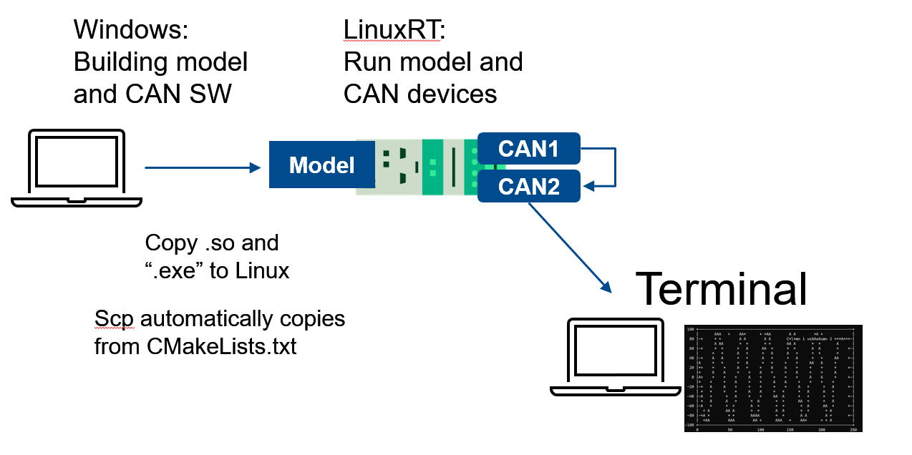

# CAN_C_API Can loop back example  

## Build (CrossComp from Win to Linux)  


```mkdir -p build```
```cd build```  

edit or uncomment CMakeLists.txt:
```
add_custom_command(TARGET ${PROJECT_NAME} POST_BUILD  
    COMMAND scp -C $<TARGET_FILE:${PROJECT_NAME}> admin@192.168.0.3:/home/Temp  
    COMMENT "Copying executable to remote server"  
)
```
```cmake -G "Ninja".. && cmake --build .```  

## Useful to know (see main branch)

NI original Examples could be found:  
> C:\Users\Public\Documents\National Instruments\NI-XNET\Examples  

And nixnet.h:  
> C:\Program Files (x86)\National Instruments\Shared\CVI\Include  

lib
C:\Program Files (x86)\National Instruments\Shared\ExternalCompilerSupport\C\lib64\msvc
dll
C:\Program Files (x86)\National Instruments\NI-XNET

C:\Program Files (x86)\National Instruments\RT Images\NI-XNET\PharLap

OBS! Added files to C:\build\2024Q4\x64\sysroots\core2-64-nilrt-linux\usr\lib\ from /usr/lib/x86_64-linux-gnu  
    ${CAN_C_API_Example_SOURCE_DIR}/lib/libnixnet.so  
    ${CAN_C_API_Example_SOURCE_DIR}/lib/libnixnetDB.so.1  
    ${CAN_C_API_Example_SOURCE_DIR}/lib/libnixntdm.so.1  
    ${CAN_C_API_Example_SOURCE_DIR}/lib/libnixnthc.so.2  
    ${CAN_C_API_Example_SOURCE_DIR}/lib/libnixntpi.so.1  
    ${CAN_C_API_Example_SOURCE_DIR}/lib/libnixnttcpip.so.23  
    ${CAN_C_API_Example_SOURCE_DIR}/lib/libxnetTrace.so.1  


## Plotting:  

./CAN_C_API_Example > plot.txt  

using gnuplot  

opkg install gnuplot  

./CAN_C_API_Example | gnuplot -persist -e "set terminal dumb; plot '-' using 0:2 with linespoints title 'Column 1 vs Column 2'"  
Press enter  
