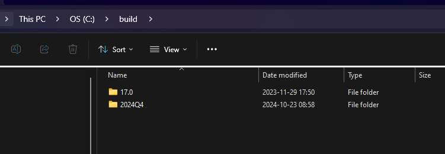

# Cross Compile NILRT  


## Pre-requisits
  
1. ni.com/downloads
2. Download GNU C & C++ Compile Tools (compilers + toolchain)
    - https://www.ni.com/en/support/downloads/software-products/download.gnu-c---c---compile-tools-x64.html#549645
3. (alternatively) Download NILRT CrossCompile Toolchain
    - NILRT CrossCompile Toolchain from NI package manager
4. Finish installation should add to build folder
    

## Run example  

1. ```cmake -p build```  
2. ```cd build```  
3. ```cmake .. -G Ninja ; ninja```  
Move you built file to target (or use Filezilla or similar):
4. ```scp main admin@your-ip:/home```

## Additional Information  

- https://nilrt-docs.ni.com/cross_compile/introduction.html